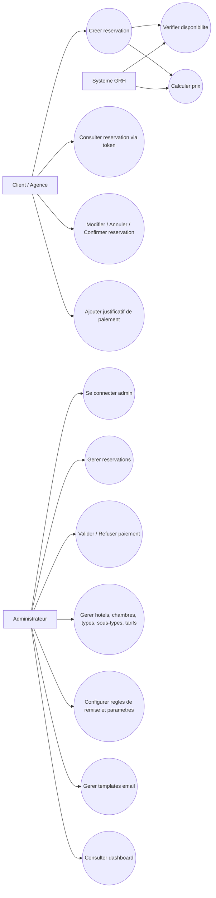
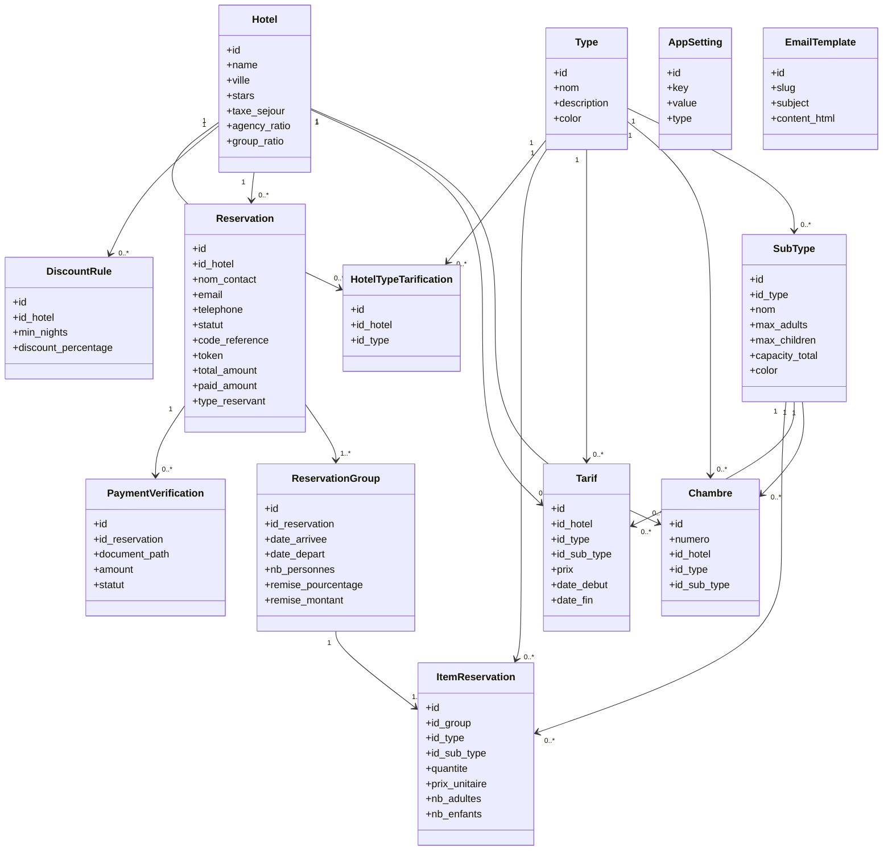
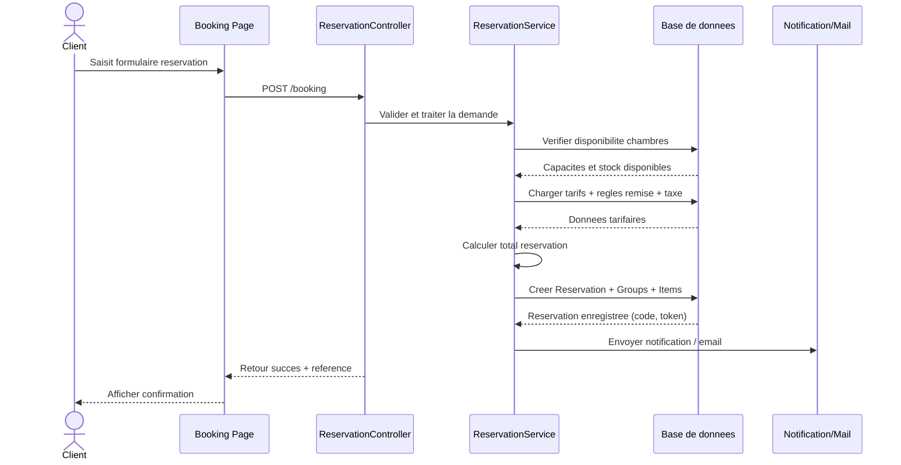
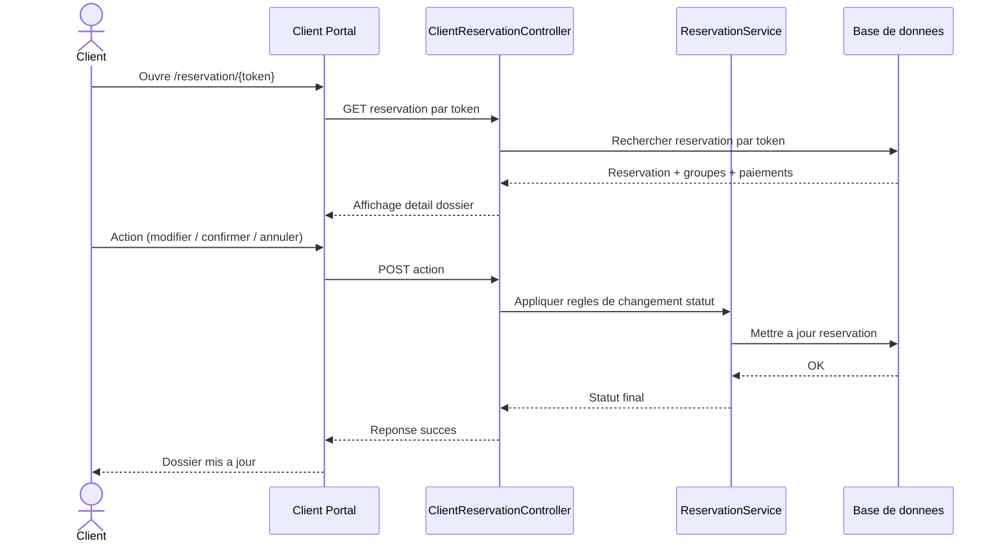
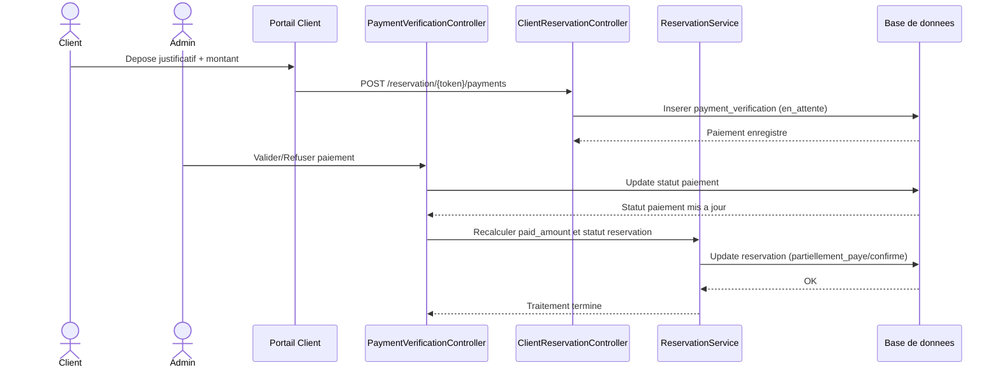
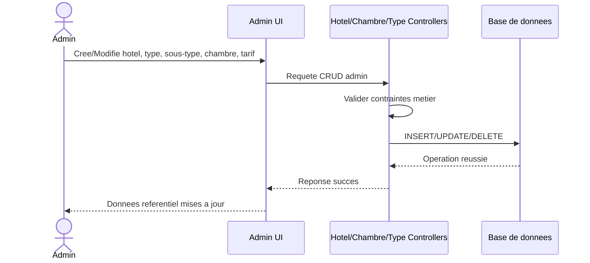

# Conception du Projet GRH

## 1. Vue d'ensemble de la conception

Cette conception couvre les composants metier principaux de l'application GRH :
- Reservation publique et suivi client via token.
- Gestion administrative des reservations, paiements et referentiels hoteliers.
- Application des regles metier (capacite, disponibilite, remises, statuts).

Les schemas ci-dessous sont fournis en format Mermaid pour integration facile dans la documentation.

---

## 2. Diagramme de cas d'utilisation

### Principaux acteurs
- **Client/Agence** : cree et suit sa reservation, depose ses paiements.
- **Administrateur** : pilote l'ensemble des operations metier.
- **Systeme GRH** : applique automatiquement les controles metier et calculs.

---

## 3. Diagramme de classes metier

---

## 4. Diagrammes de sequence (cas principaux)

## 4.1 Cas 1 - Creation d'une reservation publique

## 4.2 Cas 2 - Suivi client via token (modifier/confirmer/annuler)

## 4.3 Cas 3 - Depot puis validation de paiement

## 4.4 Cas 4 - Administration du referentiel hotelier

---

## 5. Notes de conception importantes

- Le coeur metier repose sur la coherence entre `Reservation`, `ReservationGroup` et `ItemReservation`.
- Les controles de capacite et de disponibilite doivent s'executer avant toute creation/modification.
- Les montants financiers (`total_amount`, `paid_amount`) doivent toujours etre recalcules apres operation paiement.
- Le token client est un mecanisme d'acces externe securise aux operations de suivi.
- La table `hotel_type_tarification` formalise la compatibilite entre hotels et types.

